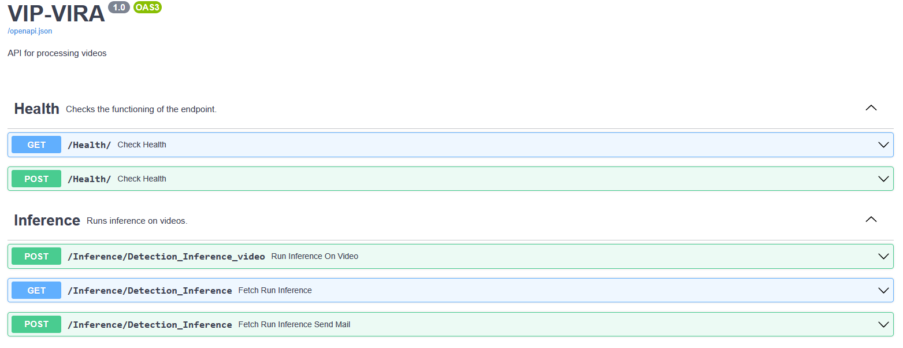

# AI Dashboard Service

## Description

An AI dashboard service that enables the inference of videos from the cloud.

## Requirements

```bash
python 3.8-3.9
```

## Install

To get started, install the proper dependencies

### Windows

#### Virtual environemnt

##### Create Virtual Environment
Run the below code in terminal from the source directory of the project
```bash 
py -3.x.x -m venv env
```
3.x.x refers to your python version, i.e. 3.8.10

##### Activate Virtual Environment
```bash 
./env/Scripts/activate
```

#### Init Directories

Run the below batch file in from the source directory of the project
```bash 
init_dir.bat
```

#### Pip

Write the following command in the terminal in the source directory of the project with the virtual environment activated
```bash
pip install -r requirements.txt
```

### Linux

#### Virtual environemnt

##### Create Virtual Environment
Run the below code in terminal from the source directory of the project
```bash 
python -3.x.x -m venv env
```
3.x.x refers to your python version, i.e. 3.8.10

##### Activate Virtual Environment
```bash 
source env/bin/activate
```

#### Init Directories + Install Requirements

Write the following command in the terminal in the source directory of the project with the virtual environment activated
```bash
source install.sh
```

## Usage

```bash
 uvicorn main:app --reload --host 0.0.0.0
```

Browse to http://localhost:8000/docs

## Available endpoints



* Check Health: To check that the endpoint is running and accessible
* Inference:
    * Run inference on video: Runs inference on an uploaded video
    * Fetch run inference: Runs inference on a video on the cloud (downloaded through a link)
    * Fetch run inference send mail: Runs inference on a video on the cloud (downloaded through a link), uploads the processed video, and sends its
      link to the user by mail
